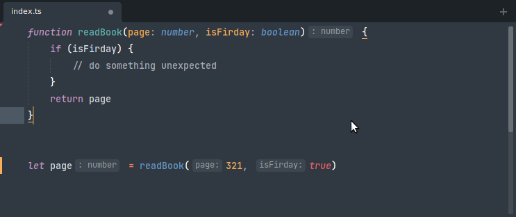

# LSP-typescript

TypeScript and JavaScript support for Sublime's LSP plugin provided through [TypeScript Language Server](https://github.com/typescript-language-server/typescript-language-server).

## Installation

 * Install [`LSP`](https://packagecontrol.io/packages/LSP) and `LSP-typescript` from Package Control.
 * For ST4: The TypeScript and React (TSX) syntaxes are built-in so no need to install anything else.
 * For ST3: If you are working with TypeScript install [TypeScript Syntax](https://packagecontrol.io/packages/TypeScript%20Syntax). If you are working with React install [JSCustom](https://packagecontrol.io/packages/JSCustom).
 * Restart Sublime.

## Configuration

Open the configuration file using the Command Palette `Preferences: LSP-typescript Settings` command or open it from the Sublime menu.

## Organize Imports command

To sort or remove unused imports you can trigger the `LSP-typescript: Organize Imports` command from the Command Palette or create a key binding. For example:

```json
{ "keys": ["ctrl+k"], "command": "lsp_execute",
  "args": {
    "session_name": "LSP-typescript",
    "command_name": "_typescript.organizeImports",
    "command_args": ["${file}"]
  }
},
```

## Code Actions on Save

The server supports the following code actions that can be specified in the global `lsp_code_actions_on_save` setting and run on saving files:

 - `source.fixAll.ts` - despite the name, fixes a couple of specific issues: unreachable code, await in non-async functions, incorrectly implemented interface
 - `source.removeUnused.ts` - removes declared but unused variables
 - `source.addMissingImports.ts` - adds imports for used but not imported symbols
 - `source.removeUnusedImports.ts` - removes unused imports
 - `source.sortImports.ts` - sorts imports
 - `source.organizeImports.ts` - organizes and removes unused imports

## Goto Source Definition command

TypeScript 4.7+ supports Go To Source Definition. It’s similar to Go To Definition, but it never returns results inside declaration files. Instead, it tries to find corresponding implementation files (like .js or .ts files), and find definitions there — even if those files are normally shadowed by .d.ts files.

This comes in handy most often when you need to peek at the implementation of a function you're importing from a library instead of its type declaration in a .d.ts file.

Run `LSP-typescript: Goto Source Definition` from the Command Palette to invoke this functionality or bind `lsp_typescript_goto_source_definition` to a custom key binding.

## Inlay hints

Inlay hints are short textual annotations that show parameter names, type hints.



To enable inlay hints:

1. Open the command palette and select `Preferences: LSP Settings`, then enable `show_inlay_hints`:

```js
{
  "show_inlay_hints": true
}
```

2. Modify the following settings through `Preferences: LSP-typescript Settings`:

```js
{
  "settings": {
    // Javascript inlay hints options.
    "javascript.inlayHints.includeInlayEnumMemberValueHints": false,
    "javascript.inlayHints.includeInlayFunctionLikeReturnTypeHints": false,
    "javascript.inlayHints.includeInlayFunctionParameterTypeHints": false,
    "javascript.inlayHints.includeInlayParameterNameHints": "none",
    "javascript.inlayHints.includeInlayParameterNameHintsWhenArgumentMatchesName": false,
    "javascript.inlayHints.includeInlayPropertyDeclarationTypeHints": false,
    "javascript.inlayHints.includeInlayVariableTypeHints": false,
    // Typescript inlay hints options.
    "typescript.inlayHints.includeInlayEnumMemberValueHints": false,
    "typescript.inlayHints.includeInlayFunctionLikeReturnTypeHints": false,
    "typescript.inlayHints.includeInlayFunctionParameterTypeHints": false,
    "typescript.inlayHints.includeInlayParameterNameHints": "none",
    "typescript.inlayHints.includeInlayParameterNameHintsWhenArgumentMatchesName": false,
    "typescript.inlayHints.includeInlayPropertyDeclarationTypeHints": false,
    "typescript.inlayHints.includeInlayVariableTypeHints": false,
  }
}
```

Note: Inlay hints require TypeScript 4.4+.

## Usage in projects that also use Flow

TypeScript can [check vanilla JavaScript](https://www.typescriptlang.org/docs/handbook/type-checking-javascript-files.html), but may break on JavaScript with Flow types in it. To keep LSP-typescript enabled for TS and vanilla JS, while ignoring Flow-typed files, you must install [JSCustom](https://packagecontrol.io/packages/JSCustom) and configure it like so:

```json
{
  "configurations": {
    "Flow": {
      "scope": "source.js.flow",
      "flow_types": true,
      "jsx": true
    }
  }
}
```

Also install [ApplySyntax](https://packagecontrol.io/packages/ApplySyntax) and configure it like so:

```json
{
  "syntaxes": [
    {
      "syntax": "User/JS Custom/Syntaxes/Flow",
      "match": "all",
      "rules": [
        { "file_path": ".*\\.jsx?$" },
        { "first_line": "^/[/\\*] *@flow" }
      ]
    }
  ]
}
```

And then configure LSP-typescript like so:

```json
{
  "selector": "source.js - source.js.flow, source.jsx, source.ts, source.tsx"
}
```

This works only on Sublime Text 4, and your project must have a `// @flow` or `/* @flow */` in each Flow-typed file. For more information, see [this issue](https://github.com/sublimelsp/LSP-typescript/issues/60).
